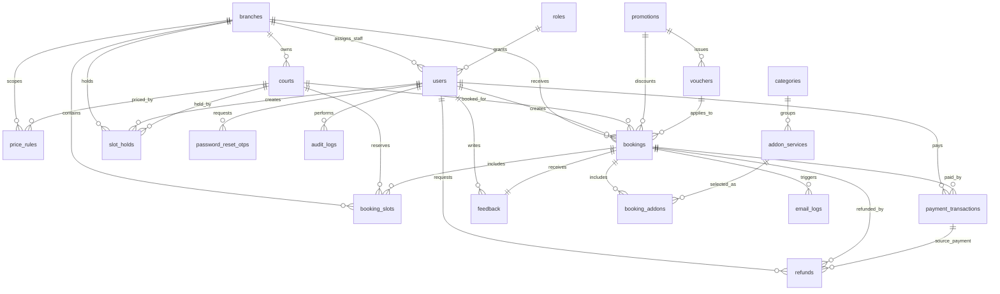

# CLAUDE.md - Pickleball Booking System v1.1
## Hệ Thống Đặt Sân Pickleball Trực Tuyến nhiều chi nhánh nhỏ tại Hà Nội

---

## TL;DR (Đọc trước - 60 giây)

> **Đây là hệ thống đặt sân pickleball trực tuyến cho nhiều chi nhánh nhỏ trong Hà Nội.**
>
> **Backend**: Node.js + Express 5 + MySQL 8.0 + `mysql2/promise`
> **Frontend**: React 19 + Vite
> **Auth**: HMAC token từ backend
> **Password**: plain text theo yêu cầu hiện tại, không phải production best practice
>
> **Branch model**: `branches` -> `courts`; Staff/Owner có thể gắn `users.branch_id`.
> **Booking model**: `slot_holds` giữ slot 10 phút; `bookings` + `booking_slots` chống trùng lịch.
> **Payment model**: `payment_transactions` ghi nhận giao dịch; `refunds` ghi nhận hoàn tiền.

### Đọc trước

1. `AGENT.md` - project rules, forbidden patterns, domain invariants.
2. `README.md` - product scope, user stories, acceptance scenarios, requirements.
3. `database.md` - database model, table meaning, ER diagram và seed data.
4. `mysql-workbench-schema.sql` - schema/seed source of truth cho MySQL Workbench.
5. File này - architecture, workflow, diagrams, conventions và lessons learned.

---

## KIẾN TRÚC HỆ THỐNG

### Sơ đồ tổng quan

```text
┌─────────────────────────────────────────────────────────────────────────────┐
│                         FRONTEND (React 19 + Vite)                         │
│                                                                             │
│  ┌────────────┐  ┌────────────┐  ┌────────────┐  ┌────────────┐            │
│  │ Home/Auth  │  │ Booking UI │  │ History UI │  │ Admin/Staff│            │
│  │ Register   │  │ Branch/Court│ │ Payment    │  │ Dashboard  │            │
│  └─────┬──────┘  └─────┬──────┘  └─────┬──────┘  └─────┬──────┘            │
└────────┼───────────────┼───────────────┼───────────────┼──────────────────┘
         │               │               │               │
         ▼               ▼               ▼               ▼
┌─────────────────────────────────────────────────────────────────────────────┐
│                         BACKEND (Node.js + Express)                        │
│                                                                             │
│  ┌───────────────────────────────────────────────────────────────────────┐  │
│  │ REST API Layer                                                        │  │
│  │ /api/auth  /api/courts  /api/staff  /api/health                       │  │
│  └───────────────────────────────┬───────────────────────────────────────┘  │
│                                  │                                          │
│                                  ▼                                          │
│  ┌───────────────────────────────────────────────────────────────────────┐  │
│  │ Controller / Business Workflow Layer                                  │  │
│  │ Auth, account management, court CRUD, availability, staff operations  │  │
│  │ Booking/payment/refund workflows are branch-aware by design           │  │
│  └───────────────────────────────┬───────────────────────────────────────┘  │
│                                  │                                          │
│                                  ▼                                          │
│  ┌───────────────────────────────────────────────────────────────────────┐  │
│  │ Model / SQL Layer                                                     │  │
│  │ mysql2/promise, parameterized SQL, row mapping, transaction support    │  │
│  └───────────────────────────────┬───────────────────────────────────────┘  │
└──────────────────────────────────┼──────────────────────────────────────────┘
                                   │
                                   ▼
┌─────────────────────────────────────────────────────────────────────────────┐
│                              MySQL 8.0                                      │
│                                                                             │
│  branches, courts, users, roles, price_rules                                │
│  slot_holds, bookings, booking_slots, booking_addons                        │
│  payment_transactions, refunds, feedback, email_logs, audit_logs            │
└─────────────────────────────────────────────────────────────────────────────┘
```

### Layer Architecture (Backend)

```text
┌─────────────────────────────────────────────┐
│ Route Layer                                 │
│ - Express routers                           │
│ - Endpoint definition                       │
│ - Auth middleware binding                   │
│ Files: backend/src/routes/*.js              │
└──────────────────────┬──────────────────────┘
                       │
                       ▼
┌─────────────────────────────────────────────┐
│ Controller Layer                            │
│ - Parse request                             │
│ - Basic validation                          │
│ - Call model/service helper                 │
│ - Format JSON response                      │
│ Files: backend/src/controllers/*.js         │
└──────────────────────┬──────────────────────┘
                       │
                       ▼
┌─────────────────────────────────────────────┐
│ Domain / Workflow Logic                     │
│ - Auth rules                                │
│ - Branch-aware availability                 │
│ - Booking/payment/refund transaction rules  │
│ - Staff check-in/check-out rules            │
│ Current: in controllers/models              │
│ Future complex flows: extract services      │
└──────────────────────┬──────────────────────┘
                       │
                       ▼
┌─────────────────────────────────────────────┐
│ Model Layer                                 │
│ - SQL queries                               │
│ - Parameter binding                         │
│ - Row mapping                               │
│ Files: backend/src/models/*.js              │
└──────────────────────┬──────────────────────┘
                       │
                       ▼
┌─────────────────────────────────────────────┐
│ MySQL                                       │
│ - Tables, constraints, triggers             │
│ - Booking/hold overlap prevention           │
│ - Audit/payment/refund persistence          │
└─────────────────────────────────────────────┘
```

### Repository Structure

```text
pickleball-booking-system/
├── .agents/
├── .github/
├── .sdd/
├── .specify/
├── .vscode/
├── backend/
│   ├── app.js
│   ├── server.js
│   ├── package.json
│   └── src/
│       ├── config/
│       │   └── db.js
│       ├── controllers/
│       │   ├── authController.js
│       │   ├── courtController.js
│       │   └── staffController.js
│       ├── middleware/
│       │   └── auth.js
│       ├── models/
│       │   ├── Court.js
│       │   ├── PasswordResetOtp.js
│       │   ├── Staff.js
│       │   └── User.js
│       ├── routes/
│       │   ├── authRoutes.js
│       │   ├── courtRoutes.js
│       │   └── staffRoutes.js
│       └── utils/
│           ├── googleAuth.js
│           ├── mailer.js
│           ├── password.js
│           └── token.js
├── frontend/
│   ├── index.html
│   ├── package.json
│   ├── vite.config.js
│   ├── public/
│   └── src/
│       ├── App.jsx
│       ├── App.css
│       ├── index.css
│       ├── main.jsx
│       └── assets/
├── AGENT.md
├── CLAUDE.md
├── README.md
├── database.md
├── DESIGN.md
├── IMPLEMENTATION.md
├── mysql-workbench-import.md
└── mysql-workbench-schema.sql
```

### Database ER Overview



### Data Flow: Booking

```text
Customer
   │
   │ choose branch, date, court, time
   ▼
Frontend Booking UI
   │
   │ GET availability / POST hold
   ▼
Express API
   │
   │ validate auth, branch, court, time, overlap
   ▼
MySQL
   │
   │ create slot_holds(active, expires_at)
   ▼
Frontend Payment UI
   │
   │ submit payment/confirmation
   ▼
Express API
   │
   │ calculate price on backend
   │ transaction: booking + booking_slots + payment + hold converted
   ▼
MySQL
   │
   │ booking confirmed, payment paid
   ▼
Staff Dashboard + Customer History
```

---

## QUYẾT ĐỊNH KIẾN TRÚC QUAN TRỌNG (ADR)

### ADR-001: Node.js + Express cho backend

**Quyết định**: Giữ backend Node.js + Express theo code hiện tại.

**Lý do**: Repo đã có Express API, dễ phát triển REST endpoints nhanh, phù hợp sprint đầu và đủ nhẹ cho hệ thống đặt sân.

**Trade-off**: Cần kỷ luật tách controller/model/service khi logic booking/payment/refund lớn dần.

**Status**: Approved.

### ADR-002: MySQL 8.0 + mysql2/promise

**Quyết định**: Dùng MySQL 8.0 và `mysql2/promise`, không chuyển sang ORM hoặc database khác.

**Lý do**: Schema đã thiết kế cho MySQL Workbench, có trigger chống overlap giữa booking slot và slot hold, seed data rõ.

**Trade-off**: Query thủ công phải dùng parameterized SQL và review kỹ để tránh injection.

**Status**: Approved.

### ADR-003: Branch-aware model, không multi-tenant

**Quyết định**: Dùng `branches` cho nhiều chi nhánh nhỏ trong Hà Nội; không tạo tenant/company isolation.

**Lý do**: Nghiệp vụ cần nhiều địa điểm vận hành nhưng vẫn thuộc một hệ thống/brand.

**Trade-off**: Nếu sau này mở rộng franchise/multi-city cần refactor scope.

**Status**: Approved.

### ADR-004: Backend owns pricing

**Quyết định**: Backend tính toàn bộ tiền sân, addon, voucher và refund policy.

**Lý do**: Tránh gian lận hoặc sai lệch từ frontend.

**Trade-off**: Frontend phải gọi API preview/quote hoặc nhận lại giá server tính, thay vì tự quyết tổng tiền.

**Status**: Approved.

### ADR-005: Slot hold trước khi thanh toán

**Quyết định**: Khi Customer chọn slot, hệ thống tạo `slot_holds` active trong 10 phút trước khi booking confirmed.

**Lý do**: Ngăn hai khách cùng thanh toán cho một sân/khung giờ.

**Trade-off**: Cần job hoặc logic cleanup hold hết hạn và cần trigger/query kiểm tra overlap chính xác.

**Status**: Approved.

### ADR-006: Password plain text là constraint tạm thời

**Quyết định**: Giữ plain text password theo yêu cầu hiện tại của dự án.

**Lý do**: Phù hợp yêu cầu hiện tại và seed/demo flow.

**Trade-off**: Không an toàn production; trước khi go-live phải nâng cấp sang hash.

**Status**: Accepted as temporary constraint.

---

## NHỮNG GÌ ĐÃ KHÔNG HOẠT ĐỘNG (Lessons Learned)

### LESSON-001: README phải khớp schema

**Biến cố**: Tài liệu từng lệch giữa mô tả một cơ sở và database đã có `branches`.

**Giải pháp**: Khi sửa scope, kiểm tra đồng thời `README.md`, `database.md`, `mysql-workbench-schema.sql`, `AGENT.md`, `CLAUDE.md`.

**Áp dụng**: Mọi thay đổi liên quan chi nhánh/sân phải đồng bộ docs và schema.

### LESSON-002: Branch là business boundary

**Biến cố**: Nếu chỉ filter UI mà backend không check `branch_id`, Staff có thể xem/sửa nhầm booking chi nhánh khác.

**Giải pháp**: Authorization = role permission + branch assignment + resource branch.

**Áp dụng**: Availability, booking, staff dashboard, payment, refund, court management.

### LESSON-003: Double-booking là lỗi nghiêm trọng nhất

**Biến cố**: Hai khách có thể tranh cùng slot nếu không có hold/overlap rule.

**Giải pháp**: Dùng `slot_holds`, `booking_slots`, trigger overlap và transaction khi convert hold thành booking.

**Áp dụng**: Mọi thay đổi vào lịch, hold, booking status hoặc court availability.

### LESSON-004: Frontend pricing không đáng tin

**Biến cố**: Nếu frontend gửi tổng tiền và backend tin ngay, người dùng có thể sửa request để giảm giá.

**Giải pháp**: Backend tính lại từ `price_rules`, addon, voucher và chính sách refund.

**Áp dụng**: Booking confirmation, payment, invoice, refund.

### LESSON-005: Plain text password phải được ghi rõ là tạm thời

**Biến cố**: Dễ nhầm thành quyết định bảo mật production.

**Giải pháp**: Mọi docs phải ghi rõ đây là yêu cầu hiện tại, cần hash trước production.

**Áp dụng**: Auth docs, API response, implementation notes.

---

## FILE STRUCTURE

### Backend (Node.js + Express)

```text
backend/
├── app.js                         # Express app, CORS, JSON middleware, routes
├── server.js                      # Starts HTTP server
├── package.json                   # Backend scripts/dependencies
└── src/
    ├── config/
    │   └── db.js                  # MySQL pool/config
    ├── controllers/
    │   ├── authController.js      # Register/login/profile/account/OTP flows
    │   ├── courtController.js     # Court CRUD and availability
    │   └── staffController.js     # Staff dashboard, booking ops, payment, addon stock
    ├── middleware/
    │   └── auth.js                # HMAC token auth middleware
    ├── models/
    │   ├── Court.js               # Court SQL access
    │   ├── PasswordResetOtp.js    # OTP/reset token SQL access
    │   ├── Staff.js               # Staff dashboard/booking/payment SQL access
    │   └── User.js                # User/account SQL access
    ├── routes/
    │   ├── authRoutes.js
    │   ├── courtRoutes.js
    │   └── staffRoutes.js
    └── utils/
        ├── googleAuth.js
        ├── mailer.js
        ├── password.js
        └── token.js
```

### Frontend (React + Vite)

```text
frontend/
├── index.html
├── package.json
├── vite.config.js
├── public/
│   ├── favicon.svg
│   └── icons.svg
└── src/
    ├── App.jsx                    # Main application UI
    ├── App.css                    # Component/page styling
    ├── index.css                  # Global styling
    ├── main.jsx                   # React root
    └── assets/
        ├── court-indoor.jpg
        ├── court-outdoor.webp
        ├── default-avatar.jpg
        ├── hero.png
        ├── logout-icon.png
        └── pickleball-hero.png
```

---

## DEVELOPMENT WORKFLOW

### Standard Flow

```text
User request
   ↓
Read README / AGENT / CLAUDE / database docs if relevant
   ↓
Inspect code paths with rg
   ↓
Plan scoped change
   ↓
Implement in existing style
   ↓
Run checks: node --check, npm build/lint, SQL review as relevant
   ↓
Review diff
   ↓
Update docs if API/schema/business rules changed
   ↓
Report files changed and checks run
```

### Workflow Commands

```bash
# Backend
cd backend
npm install
npm run dev
npm start

# Frontend
cd frontend
npm install
npm run dev
npm run build
npm run lint
```

### Supporting Commands

```bash
# Search files
rg --files

# Search symbols/routes
rg "router\\.|app\\.use|module\\.exports" backend

# Syntax check backend files
node --check backend/app.js
node --check backend/server.js
node --check backend/src/controllers/authController.js

# Check changed files
git status --short
git diff -- README.md AGENT.md CLAUDE.md
```

---

## RULES & GUIDELINES

### ALWAYS DO

- Luôn giữ domain là đặt sân pickleball nhiều chi nhánh nhỏ tại Hà Nội.
- Luôn kiểm tra backend validation cho booking, payment, branch scope và auth.
- Luôn dùng parameterized SQL với `mysql2/promise`.
- Luôn đảm bảo API không trả `password`.
- Luôn để backend tính giá.
- Luôn cập nhật docs khi thay đổi endpoint, schema hoặc business rule.
- Luôn báo rõ check nào đã chạy và check nào chưa chạy được.

### NEVER DO

- Không đưa domain hoặc stack khác vào tài liệu hoặc code.
- Không tin dữ liệu nhạy cảm từ frontend.
- Không cho booking quá khứ.
- Không cho double-booking.
- Không xóa payment/refund/audit transaction.
- Không hard-code secret.
- Không sửa rộng ngoài yêu cầu.

### Code Quality

- Use English names for code identifiers.
- User-facing Vietnamese must be readable and consistent.
- Keep controllers readable; extract services when workflow grows.
- Use explicit status names: `pending`, `confirmed`, `checked_in`, `completed`, `cancelled`, `expired`, `no_show`.
- Prefer small focused changes over broad rewrites.

---

## NAMING CONVENTIONS

### JavaScript (Backend)

| Type | Convention | Example |
| --- | --- | --- |
| Files | camelCase or existing pattern | `authController.js` |
| Functions | camelCase | `calculateBookingTotal()` |
| Constants | UPPER_SNAKE_CASE | `ACTIVE_BOOKING_STATUSES` |
| Model methods | verb + domain noun | `findCourtById()` |

### React (Frontend)

| Type | Convention | Example |
| --- | --- | --- |
| Components | PascalCase | `CourtSchedule.jsx` |
| Event handlers | handle + action | `handleSelectSlot()` |
| State variables | descriptive camelCase | `selectedBranchId` |
| CSS classes | existing style or kebab-case | `booking-panel` |

### API Routes

| Resource | Pattern | Example |
| --- | --- | --- |
| Auth | `/api/auth/[action]` | `/api/auth/login` |
| Courts | `/api/courts/:id` | `/api/courts/1/availability` |
| Staff | `/api/staff/[resource]` | `/api/staff/bookings/:id/check-in` |
| Future booking | `/api/bookings/[action]` | `/api/bookings/:id/cancel` |

---

## GIT CONVENTIONS

### Branch Naming

```text
feat/[feature-name]
fix/[bug-name]
spec/[feature-name]
docs/[short-name]
chore/[short-name]
```

### Commit Format

```text
[type]([scope]): [description]
```

Examples:

- `feat(booking): add branch-aware slot hold`
- `fix(courts): prevent cross-branch availability leak`
- `docs(readme): align pickleball spec with template`

### Pull Request Rules

- Minimum 1 approval before merge in team workflow.
- Keep PRs focused by spec/feature.
- All relevant checks should pass.
- No TODO comments left in completed code.
- Never commit directly into `main` or `production`.

---

## QUICK REFERENCE

### Core Entities

| Entity | Purpose |
| --- | --- |
| `branches` | Chi nhánh pickleball tại Hà Nội |
| `courts` | Sân con thuộc chi nhánh |
| `users` / `roles` | Tài khoản và phân quyền |
| `price_rules` | Giá theo giờ/chi nhánh/sân |
| `slot_holds` | Giữ slot tạm thời 10 phút |
| `bookings` | Đơn đặt sân |
| `booking_slots` | Khung giờ chi tiết để chống overlap |
| `addon_services` | Dịch vụ kèm |
| `payment_transactions` | Giao dịch thanh toán |
| `refunds` | Hoàn tiền |
| `feedback` | Đánh giá sau buổi chơi |
| `audit_logs` | Lịch sử thao tác |

### Key Business Rules

- Email đăng ký bắt buộc `@gmail.com`.
- Booking không được nằm trong quá khứ.
- Booking active: `pending`, `confirmed`, `checked_in`.
- Hold active chặn slot cho đến khi hết hạn hoặc chuyển thành booking.
- Slot hold mặc định 10 phút.
- Giờ mở cửa mặc định: `05:00` - `22:00`.
- Giờ cao điểm mặc định: `17:00` - `21:00`.
- Backend tính tiền, không tin tổng tiền frontend.
- Staff chỉ thao tác dữ liệu chi nhánh được phân công.
- API không expose password.

### Current API

Auth/account:

- `POST /api/auth/register`
- `POST /api/auth/login`
- `POST /api/auth/google-login`
- `POST /api/auth/forgot-password/request-otp`
- `POST /api/auth/forgot-password/verify-otp`
- `POST /api/auth/forgot-password/reset`
- `POST /api/auth/password`
- `GET /api/auth/me`
- `PUT /api/auth/me`
- `GET /api/auth/accounts`
- `POST /api/auth/accounts`
- `GET /api/auth/accounts/:id/bookings`
- `PUT /api/auth/accounts/:id`
- `PATCH /api/auth/accounts/:id/status`
- `DELETE /api/auth/accounts/:id`

Courts:

- `GET /api/courts`
- `POST /api/courts`
- `GET /api/courts/:id`
- `PATCH /api/courts/:id`
- `DELETE /api/courts/:id`
- `GET /api/courts/:id/availability`

Staff:

- `GET /api/staff/dashboard`
- `POST /api/staff/bookings/:id/confirm`
- `POST /api/staff/bookings/:id/cancel`
- `POST /api/staff/bookings/:id/check-in`
- `POST /api/staff/bookings/:id/check-out`
- `POST /api/staff/bookings/:id/payment`
- `PATCH /api/staff/addons/:id/stock`

System:

- `GET /api/health`

### Current Sprint

Sprint: Sprint 1

Focus:

- Auth/account flow
- Court management
- Staff dashboard
- Branch-aware data model
- Booking/payment/refund foundation in schema
- Documentation alignment with pickleball scope

---

## SWIMLANE DIAGRAMS

### Business Process Swimlanes

Các swimlane dưới đây dùng để giữ cùng một mental model giữa product, backend, frontend và database. Khi implement hoặc sửa workflow, ưu tiên giữ đúng thứ tự nghiệp vụ trong sơ đồ.

#### Booking Process (Đặt sân online)

```text
┌─────────────────────────────────────────────────────────────────────────────────────────────────────────────┐
│ BOOKING PROCESS SWIMLANES                                                                                  │
├──────────────┬──────────────┬──────────────┬──────────────┬──────────────┬────────────────────────────────┤
│   CUSTOMER   │   FRONTEND   │   BACKEND    │    MYSQL     │    STAFF     │            NOTES               │
├──────────────┼──────────────┼──────────────┼──────────────┼──────────────┼────────────────────────────────┤
│              │              │              │              │              │                                │
│ Login/Register              │              │              │              │ Email must end @gmail.com       │
│ ────────────►│              │              │              │              │                                │
│              │ POST /auth   │              │              │              │                                │
│              │─────────────►│ Validate     │              │              │ HMAC token returned             │
│              │              │─────────────►│ users        │              │                                │
│              │              │◄─────────────│              │              │                                │
│              │◄─────────────│ token        │              │              │                                │
│              │              │              │              │              │                                │
│ Choose branch/date/court    │              │              │              │                                │
│ ────────────►│              │              │              │              │                                │
│              │ GET availability            │              │              │                                │
│              │─────────────►│ Check branch │              │              │ Court must belong to branch      │
│              │              │─────────────►│ bookings +   │              │ Active booking/hold blocks slot  │
│              │              │              │ slot_holds   │              │                                │
│              │◄─────────────│ availability │              │              │                                │
│              │              │              │              │              │                                │
│ Select slot  │              │              │              │              │                                │
│ ────────────►│ POST hold    │              │              │              │                                │
│              │─────────────►│ Validate time│              │              │ No past booking                  │
│              │              │ + overlap    │              │              │                                │
│              │              │─────────────►│ slot_holds   │              │ Create active hold, 10 minutes   │
│              │◄─────────────│ hold_code    │              │              │                                │
│              │              │              │              │              │                                │
│ Pay/confirm  │              │              │              │              │                                │
│ ────────────►│ POST payment │              │              │              │                                │
│              │─────────────►│ Calculate    │              │              │ Backend owns pricing             │
│              │              │ price        │              │              │                                │
│              │              │─────────────►│ transaction  │              │ booking + slots + payment        │
│              │              │              │ bookings     │              │ hold converted                   │
│              │◄─────────────│ confirmed    │              │              │                                │
│◄─────────────│ Show success │              │              │ Dashboard    │ Staff can see booking            │
└──────────────┴──────────────┴──────────────┴──────────────┴──────────────┴────────────────────────────────┘

Status Flow:
slot_holds.active → slot_holds.converted
booking.pending → booking.confirmed
payment.pending → payment.paid
```

#### Availability Process (Xem lịch sân)

```text
┌────────────────────────────────────────────────────────────────────────────────────────────┐
│ AVAILABILITY PROCESS SWIMLANES                                                            │
├──────────────┬──────────────┬──────────────┬──────────────┬───────────────────────────────┤
│   CUSTOMER   │   FRONTEND   │   BACKEND    │    MYSQL     │             NOTES             │
├──────────────┼──────────────┼──────────────┼──────────────┼───────────────────────────────┤
│ Select date  │              │              │              │                               │
│ and branch   │              │              │              │                               │
│─────────────►│ Build query  │              │              │                               │
│              │─────────────►│ Validate auth│              │                               │
│              │              │ + branch     │              │                               │
│              │              │─────────────►│ courts       │ Get courts by branch          │
│              │              │─────────────►│ bookings     │ Active bookings only          │
│              │              │─────────────►│ slot_holds   │ Active, non-expired holds     │
│              │              │─────────────►│ price_rules  │ Return server-side price data │
│              │◄─────────────│ schedule map │              │                               │
│ View slots   │              │              │              │                               │
│◄─────────────│ Render color │              │              │                               │
└──────────────┴──────────────┴──────────────┴──────────────┴───────────────────────────────┘

Slot States:
AVAILABLE | HELD | BOOKED | CHECKED_IN | COMPLETED | CANCELLED | MAINTENANCE
```

#### Payment Process (Thanh toán)

```text
┌────────────────────────────────────────────────────────────────────────────────────────────────┐
│ PAYMENT PROCESS SWIMLANES                                                                      │
├──────────────┬──────────────┬──────────────┬──────────────┬──────────────┬────────────────────┤
│   CUSTOMER   │    STAFF     │   BACKEND    │    MYSQL     │    EMAIL     │       NOTES        │
├──────────────┼──────────────┼──────────────┼──────────────┼──────────────┼────────────────────┤
│              │              │              │              │              │                    │
│ Submit pay   │              │              │              │              │ Online/counter     │
│─────────────►│ or Staff pay │              │              │              │                    │
│              │─────────────►│ Validate hold│              │              │                    │
│              │              │ + booking    │              │              │                    │
│              │              │─────────────►│ price_rules  │              │ Server calculates  │
│              │              │◄─────────────│ addon/voucher│              │                    │
│              │              │              │              │              │                    │
│              │              │ Begin transaction           │              │                    │
│              │              │─────────────►│ bookings     │ confirmed    │                    │
│              │              │─────────────►│ booking_slots│ reserved     │                    │
│              │              │─────────────►│ payments     │ paid/failed  │                    │
│              │              │─────────────►│ slot_holds   │ converted    │                    │
│              │              │ Commit       │              │              │                    │
│              │◄─────────────│ success      │              │              │                    │
│◄─────────────│ receipt      │              │              │              │                    │
│              │              │─────────────►│ email_logs   │              │ If mail enabled    │
│              │              │──────────────┼─────────────►│ send confirm │                    │
└──────────────┴──────────────┴──────────────┴──────────────┴──────────────┴────────────────────┘

Status Flow:
payment.pending → payment.paid
booking.pending → booking.confirmed
```

#### Cancellation and Refund Process (Hủy lịch & hoàn tiền)

```text
┌──────────────────────────────────────────────────────────────────────────────────────────────────┐
│ CANCELLATION / REFUND PROCESS SWIMLANES                                                          │
├──────────────┬──────────────┬──────────────┬──────────────┬──────────────┬──────────────────────┤
│   CUSTOMER   │   FRONTEND   │   BACKEND    │    MYSQL     │    STAFF     │        POLICY        │
├──────────────┼──────────────┼──────────────┼──────────────┼──────────────┼──────────────────────┤
│ Request      │              │              │              │              │                      │
│ cancel       │              │              │              │              │                      │
│─────────────►│ Confirm UI   │              │              │              │                      │
│              │─────────────►│ Load booking │              │              │                      │
│              │              │─────────────►│ bookings     │              │ Check owner/customer │
│              │              │◄─────────────│              │              │                      │
│              │              │ Calculate    │              │              │ >=24h: 100% refund   │
│              │              │ refund %     │              │              │ 2-24h: 50% refund    │
│              │              │              │              │              │ <2h: no auto refund  │
│              │              │ Begin transaction           │              │                      │
│              │              │─────────────►│ bookings     │ cancelled    │                      │
│              │              │─────────────►│ refunds      │ created      │                      │
│              │              │─────────────►│ payments     │ updated      │                      │
│              │              │─────────────►│ audit_logs   │ logged       │                      │
│              │              │ Commit       │              │              │                      │
│              │◄─────────────│ result       │              │ Notify if    │                      │
│◄─────────────│ Show refund  │              │              │ manual case  │                      │
└──────────────┴──────────────┴──────────────┴──────────────┴──────────────┴──────────────────────┘

Status Flow:
booking.confirmed → booking.cancelled
payment.paid → payment.partially_refunded / payment.refunded
refund.pending → refund.processed / refund.rejected
```

#### Staff Check-in / Check-out Process

```text
┌─────────────────────────────────────────────────────────────────────────────────────────────┐
│ STAFF CHECK-IN / CHECK-OUT PROCESS SWIMLANES                                                │
├──────────────┬──────────────┬──────────────┬──────────────┬────────────────────────────────┤
│    STAFF     │   FRONTEND   │   BACKEND    │    MYSQL     │             NOTES              │
├──────────────┼──────────────┼──────────────┼──────────────┼────────────────────────────────┤
│ Open dashboard              │              │              │                                │
│─────────────►│ GET dashboard│              │              │                                │
│              │─────────────►│ Check auth   │              │ Staff branch scope             │
│              │              │─────────────►│ bookings     │ Today bookings only            │
│              │◄─────────────│ booking list │              │                                │
│              │              │              │              │                                │
│ Customer arrives            │              │              │                                │
│─────────────►│ Check-in     │              │              │                                │
│              │─────────────►│ Validate     │              │ Must be confirmed              │
│              │              │ branch/status│              │                                │
│              │              │─────────────►│ bookings     │ checked_in_at                  │
│              │◄─────────────│ checked_in   │              │                                │
│              │              │              │              │                                │
│ Session ends │              │              │              │                                │
│─────────────►│ Check-out    │              │              │                                │
│              │─────────────►│ Validate     │              │ Must be checked_in             │
│              │              │─────────────►│ bookings     │ checked_out_at, completed      │
│              │◄─────────────│ completed    │              │                                │
└──────────────┴──────────────┴──────────────┴──────────────┴────────────────────────────────┘

Status Flow:
confirmed → checked_in → completed
```

#### Court Maintenance Process (Bảo trì sân)

```text
┌──────────────────────────────────────────────────────────────────────────────────────────────┐
│ COURT MAINTENANCE PROCESS SWIMLANES                                                          │
├──────────────┬──────────────┬──────────────┬──────────────┬──────────────┬─────────────────┤
│ STAFF/ADMIN  │   FRONTEND   │   BACKEND    │    MYSQL     │   CUSTOMER   │      NOTES      │
├──────────────┼──────────────┼──────────────┼──────────────┼──────────────┼─────────────────┤
│ Mark court   │              │              │              │              │                 │
│ maintenance  │              │              │              │              │                 │
│─────────────►│ PATCH court  │              │              │              │                 │
│              │─────────────►│ Validate role│              │              │                 │
│              │              │ + branch     │              │              │                 │
│              │              │─────────────►│ courts       │ status update│                 │
│              │              │─────────────►│ bookings     │ future active│ Find impacted   │
│              │◄─────────────│ impacted list│              │              │                 │
│ Contact      │              │              │              │              │ Manual or auto  │
│ customers    │              │              │              │              │ refund policy   │
│─────────────►│ cancel/refund│─────────────►│ refunds      │◄─────────────│ notify          │
└──────────────┴──────────────┴──────────────┴──────────────┴──────────────┴─────────────────┘

Status Flow:
court.available → court.maintenance → court.available
impacted booking.confirmed → booking.cancelled + refund if required
```

#### Addon Stock Process (Quản lý dịch vụ kèm)

```text
┌────────────────────────────────────────────────────────────────────────────────────────────┐
│ ADDON STOCK PROCESS SWIMLANES                                                             │
├──────────────┬──────────────┬──────────────┬──────────────┬───────────────────────────────┤
│ STAFF/OWNER  │   FRONTEND   │   BACKEND    │    MYSQL     │            NOTES              │
├──────────────┼──────────────┼──────────────┼──────────────┼───────────────────────────────┤
│ Update stock │              │              │              │                               │
│─────────────►│ PATCH addon  │              │              │                               │
│              │─────────────►│ Validate role│              │ Owner/Admin/Staff permissions │
│              │              │─────────────►│ addon_services              │ stock_quantity │
│              │◄─────────────│ updated      │              │                               │
│ Customer selects addon       │              │              │                               │
│─────────────►│ Booking UI   │─────────────►│ Check active │─────────────►│ addon_services │
│              │              │ + stock      │              │                               │
│              │◄─────────────│ allowed/deny │              │ price locked at booking time   │
└──────────────┴──────────────┴──────────────┴──────────────┴───────────────────────────────┘
```

#### Password Reset OTP Process

```text
┌──────────────────────────────────────────────────────────────────────────────────────────────┐
│ PASSWORD RESET OTP PROCESS SWIMLANES                                                         │
├──────────────┬──────────────┬──────────────┬──────────────┬──────────────┬─────────────────┤
│   CUSTOMER   │   FRONTEND   │   BACKEND    │    MYSQL     │    EMAIL     │      NOTES      │
├──────────────┼──────────────┼──────────────┼──────────────┼──────────────┼─────────────────┤
│ Request OTP  │              │              │              │              │                 │
│─────────────►│ POST request │              │              │              │                 │
│              │─────────────►│ Find user    │─────────────►│ users        │ Email @gmail    │
│              │              │ Create OTP   │─────────────►│ otps hash    │ Store hash only │
│              │              │──────────────┼─────────────►│ send OTP     │ SMTP optional   │
│              │◄─────────────│ request ok   │              │              │                 │
│ Enter OTP    │              │              │              │              │                 │
│─────────────►│ POST verify  │─────────────►│ Verify hash  │─────────────►│ otps           │
│              │◄─────────────│ reset token  │              │              │ Token returned  │
│ New password │              │              │              │              │                 │
│─────────────►│ POST reset   │─────────────►│ Validate     │─────────────►│ users password │
└──────────────┴──────────────┴──────────────┴──────────────┴──────────────┴─────────────────┘
```

---

## ANTI-PATTERNS (Tránh xa)

### Code Anti-Patterns

| Anti-Pattern | Description | How to Avoid |
| --- | --- | --- |
| Fat Controller | Controller xử lý quá nhiều business logic | Extract service/helper for booking/payment/refund workflows |
| SQL String Concatenation | Dễ SQL injection | Use placeholders and `mysql2/promise` parameters |
| Frontend Pricing | Customer có thể sửa tổng tiền | Backend calculates all price values |
| Cross-Branch Leakage | Staff xem/sửa dữ liệu sai chi nhánh | Always check role + assigned branch + resource branch |
| Password Exposure | API trả password hoặc hash | Select explicit safe fields |
| Silent Catch | Bắt lỗi rồi bỏ qua | Return clear API error and log appropriately |
| Broad Refactor | Sửa lan rộng ngoài yêu cầu | Keep change aligned with acceptance criteria |

### Database Anti-Patterns

| Anti-Pattern | Description | How to Avoid |
| --- | --- | --- |
| Missing Overlap Check | Cho double-booking | Use booking_slots, slot_holds, triggers and transaction |
| Physical Delete Transactions | Mất audit trail | Use status updates for booking/payment/refund |
| Trusting Client Branch | Frontend gửi branch_id giả | Derive branch from selected court server-side |
| Money as Float | Sai số tiền VND | Store money as integer VND |
| Unbounded Logs | Log phình không kiểm soát | Add retention/export strategy in production |

### Express / Node Anti-Patterns

| Anti-Pattern | Description | How to Avoid |
| --- | --- | --- |
| Async Error Loss | Promise rejection không được xử lý | Use try/catch in async controllers |
| Global Mutable State | State request dùng chung process | Store state in DB/session/token only |
| Hard-coded Config | DB/password/token nằm trong source | Use environment variables |
| Console Debug Leftover | Log rác ở production | Remove debug logs, keep intentional error logs |

### React Anti-Patterns

| Anti-Pattern | Description | How to Avoid |
| --- | --- | --- |
| God Component | `App.jsx` quá lớn và khó bảo trì | Split screens/components when scope grows |
| State Drift | UI tự tin slot còn trống sau khi hold hết hạn | Refresh availability and respect server response |
| Frontend-only Auth | Ẩn nút nhưng backend không check role | Backend must enforce permissions |
| Overfetching | Fetch quá nhiều dữ liệu cho dashboard | Add filters/pagination when data grows |
| Missing Loading/Error | Form không phản hồi khi API chậm | Always show loading/error states |

### Business Anti-Patterns

| Anti-Pattern | Description | How to Avoid |
| --- | --- | --- |
| Multi-City Creep | Tự mở rộng ra nhiều tỉnh/thành | Keep Hanoi branch scope until spec changes |
| Tournament Creep | Thêm giải đấu/ranking ngoài yêu cầu | Keep booking operations as core |
| Manual Refund Without Record | Hoàn tiền ngoài hệ thống | Always create `refunds`/payment status/audit trail |
| Maintenance Without Customer Handling | Đóng sân nhưng không xử lý booking | List impacted bookings and apply cancel/refund workflow |

---

## TESTING ANTI-PATTERNS TO AVOID

| Anti-Pattern | Description | Fix |
| --- | --- | --- |
| Test only happy path | Không bắt lỗi double-booking/past booking | Add error scenarios |
| No branch-scope tests | Staff có thể leak dữ liệu | Test wrong-branch access |
| Mock everything | Không phát hiện SQL/schema mismatch | Add integration checks where feasible |
| Brittle selectors | UI tests vỡ khi đổi text nhỏ | Prefer stable test ids when tests are added |
| No assertion | Test chỉ chạy code | Assert response status, data shape and side effects |
| Real secrets in tests | Lộ credentials | Use local `.env` or test config not committed |

---

## DEFINITION OF DONE

- Code/docs đúng domain pickleball.
- Không còn tiêu đề/nội dung của domain hoặc stack khác.
- Không phá branch boundary.
- Không tạo đường double-booking hoặc booking quá khứ.
- Backend không tin frontend pricing.
- API không expose password.
- Email `@gmail.com` vẫn được validate.
- MySQL schema import được nếu có thay đổi SQL.
- `node --check` chạy cho backend files đã sửa khi phù hợp.
- `npm run build`/`npm run lint` chạy cho frontend khi sửa UI/behavior.
- Docs cập nhật nếu thay đổi API/schema/business rule.
- Báo cáo cuối nêu rõ file đã sửa và check đã chạy.
