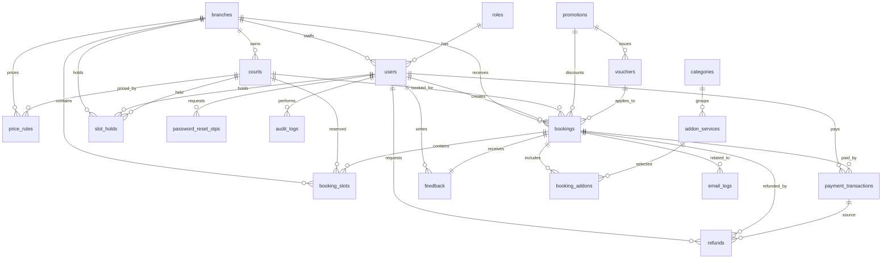

# Pickleball Booking System - MySQL Database Design

Database dung cho he thong dat san pickleball truc tuyen quan ly **nhieu chi nhanh nho tai Ha Noi**.

## Scope

- Khong quan ly nhieu tinh/thanh pho, chi tap trung tai Ha Noi.
- Co quan ly nhieu chi nhanh nho trong Ha Noi.
- Co bang `branches` de luu tung chi nhanh.
- Moi chi nhanh co nhieu san con.
- User co role `Admin`, `Owner`, `Staff`, `Customer`.
- File SQL chinh dung de import MySQL Workbench: `mysql-workbench-schema.sql`.

## Thong Tin Import

| Muc | Gia tri |
| --- | --- |
| Database | `pickleball_booking_system` |
| MySQL | 8.0+ |
| Charset | `utf8mb4` |
| Collation | `utf8mb4_unicode_ci` |
| Engine | `InnoDB` |
| Timezone mac dinh | `Asia/Ho_Chi_Minh` |
| Currency | `VND` |

## Danh Sach Bang

| Nhom | Bang |
| --- | --- |
| Cau hinh he thong va chi nhanh | `settings`, `branches` |
| Tai khoan va phan quyen | `roles`, `users`, `password_reset_otps` |
| San va gia | `courts`, `price_rules` |
| Khuyen mai | `promotions`, `vouchers` |
| Dat san | `bookings`, `booking_slots`, `slot_holds` |
| Dich vu kem | `categories`, `addon_services`, `booking_addons` |
| Thanh toan va hoan tien | `payment_transactions`, `refunds` |
| Van hanh | `feedback`, `email_logs`, `audit_logs` |

## Cau Truc Bang Chinh

### `settings`

Luu cau hinh chung toan he thong.

| Cot | Kieu | Ghi chu |
| --- | --- | --- |
| `id` | `BIGINT UNSIGNED` | PK, auto increment |
| `venue_name` | `VARCHAR(150)` | Ten thuong hieu/he thong |
| `city` | `VARCHAR(100)` | Mac dinh `Ha Noi` |
| `address` | `VARCHAR(255)` | Dia chi lien he chinh |
| `phone` | `VARCHAR(30)` | So dien thoai |
| `email` | `VARCHAR(150)` | Email lien he |
| `open_time` | `TIME` | Mac dinh `05:00:00` |
| `close_time` | `TIME` | Mac dinh `22:00:00` |
| `slot_minutes` | `SMALLINT UNSIGNED` | Mac dinh `30` |
| `hold_minutes` | `SMALLINT UNSIGNED` | Mac dinh `10` |
| `timezone` | `VARCHAR(80)` | Mac dinh `Asia/Ho_Chi_Minh` |
| `currency` | `CHAR(3)` | Mac dinh `VND` |
| `created_at`, `updated_at` | `TIMESTAMP` | Tu dong cap nhat |

Rang buoc:

- `open_time < close_time`
- `slot_minutes > 0`
- `hold_minutes BETWEEN 1 AND 15`

### `branches`

Luu danh sach chi nhanh nho trong Ha Noi.

| Cot | Kieu | Ghi chu |
| --- | --- | --- |
| `id` | `BIGINT UNSIGNED` | PK, auto increment |
| `code` | `VARCHAR(30)` | Unique, vi du `HN-TAYHO` |
| `name` | `VARCHAR(150)` | Ten chi nhanh |
| `district` | `VARCHAR(100)` | Quan/huyen tai Ha Noi |
| `address` | `VARCHAR(255)` | Dia chi chi nhanh |
| `phone` | `VARCHAR(30)` | Hotline chi nhanh |
| `email` | `VARCHAR(150)` | Email chi nhanh |
| `open_time` | `TIME` | Gio mo cua rieng cua chi nhanh |
| `close_time` | `TIME` | Gio dong cua rieng cua chi nhanh |
| `status` | `ENUM` | `active`, `maintenance`, `inactive` |
| `created_at`, `updated_at` | `TIMESTAMP` | Tu dong cap nhat |

Rang buoc:

- `code` unique.
- `open_time < close_time`.
- Moi chi nhanh nam trong Ha Noi, khong can bang `regions`.

### `roles`

Luu danh sach role trong he thong.

| Cot | Kieu | Ghi chu |
| --- | --- | --- |
| `id` | `TINYINT UNSIGNED` | PK, auto increment |
| `code` | `VARCHAR(40)` | Unique, vi du `Admin` |
| `name` | `VARCHAR(80)` | Ten hien thi |
| `description` | `VARCHAR(255)` | Mo ta |

### `users`

Luu tai khoan nguoi dung.

| Cot | Kieu | Ghi chu |
| --- | --- | --- |
| `id` | `BIGINT UNSIGNED` | PK, auto increment |
| `full_name` | `VARCHAR(150)` | Ho ten |
| `email` | `VARCHAR(150)` | Unique, bat buoc co duoi `@gmail.com` |
| `phone` | `VARCHAR(30)` | So dien thoai |
| `password` | `VARCHAR(255)` | Dang luu plain text theo yeu cau hien tai |
| `avatar_url` | `LONGTEXT` | URL avatar hoac data URL anh upload |
| `branch_id` | `BIGINT UNSIGNED` | FK den `branches.id`, dung cho Staff/Owner phu trach chi nhanh |
| `role_id` | `TINYINT UNSIGNED` | FK den `roles.id` |
| `status` | `ENUM` | `Active`, `Inactive`, `Blocked`, `Unverified` |
| `email_verified_at` | `DATETIME` | Thoi diem xac thuc email |
| `last_login_at` | `DATETIME` | Lan dang nhap gan nhat |
| `created_at`, `updated_at` | `TIMESTAMP` | Tu dong cap nhat |

Index va rang buoc:

- `uq_users_email (email)`
- `idx_users_phone (phone)`
- `idx_users_branch_role_status (branch_id, role_id, status)`
- `idx_users_role_status (role_id, status)`
- `chk_users_gmail CHECK (email LIKE '%@gmail.com')`

### `password_reset_otps`

Luu OTP va reset token cho luong quen mat khau.

| Cot | Kieu | Ghi chu |
| --- | --- | --- |
| `id` | `BIGINT UNSIGNED` | PK, auto increment |
| `user_id` | `BIGINT UNSIGNED` | FK den `users.id`, xoa cascade |
| `email` | `VARCHAR(150)` | Email nhan OTP |
| `otp_hash` | `CHAR(64)` | Hash OTP |
| `reset_token_hash` | `CHAR(64)` | Hash reset token |
| `attempt_count` | `TINYINT UNSIGNED` | So lan thu, toi da 10 |
| `expires_at` | `DATETIME` | Thoi diem het han |
| `verified_at` | `DATETIME` | Thoi diem verify OTP |
| `used_at` | `DATETIME` | Thoi diem da su dung |
| `created_at`, `updated_at` | `TIMESTAMP` | Tu dong cap nhat |

### `courts`

Luu danh sach san con thuoc tung chi nhanh.

| Cot | Kieu | Ghi chu |
| --- | --- | --- |
| `id` | `BIGINT UNSIGNED` | PK, auto increment |
| `branch_id` | `BIGINT UNSIGNED` | FK den `branches.id` |
| `code` | `VARCHAR(30)` | Unique, vi du `A1` |
| `name` | `VARCHAR(120)` | Ten san |
| `address` | `VARCHAR(255)` | Dia chi rieng cho tung san, mac dinh theo chi nhanh |
| `court_type` | `ENUM` | `indoor`, `outdoor` |
| `surface_type` | `ENUM` | `standard`, `premium`, `synthetic`, `concrete`, `wood` |
| `base_price_per_hour` | `INT UNSIGNED` | Gia co ban theo gio |
| `peak_price_per_slot` | `INT UNSIGNED` | Gia slot gio cao diem, mac dinh `120000` |
| `off_peak_price_per_slot` | `INT UNSIGNED` | Gia slot gio thap diem, mac dinh `80000` |
| `facilities` | `JSON` | Tien ich cua san |
| `status` | `ENUM` | `available`, `maintenance`, `inactive` |
| `created_at`, `updated_at` | `TIMESTAMP` | Tu dong cap nhat |

Rang buoc:

- `branch_id` tham chieu `branches.id`.
- Ma san nen unique theo chi nhanh: `(branch_id, code)`.
- Moi san chi thuoc mot chi nhanh.

### `price_rules`

Luu rule tinh gia theo san, ngay trong tuan va khung gio.

| Cot | Kieu | Ghi chu |
| --- | --- | --- |
| `id` | `BIGINT UNSIGNED` | PK, auto increment |
| `branch_id` | `BIGINT UNSIGNED` | FK den `branches.id`, co the NULL de ap dung toan he thong |
| `court_id` | `BIGINT UNSIGNED` | FK den `courts.id`, co the NULL de ap dung theo chi nhanh/toan he thong |
| `name` | `VARCHAR(120)` | Ten rule |
| `day_of_week` | `TINYINT UNSIGNED` | NULL hoac tu 1 den 7 |
| `start_time` | `TIME` | Gio bat dau |
| `end_time` | `TIME` | Gio ket thuc |
| `price_per_slot` | `INT UNSIGNED` | Gia moi slot |
| `priority` | `SMALLINT UNSIGNED` | Do uu tien, so nho uu tien hon |
| `valid_from`, `valid_to` | `DATE` | Thoi gian hieu luc |
| `is_active` | `BOOLEAN` | Trang thai kich hoat |
| `created_at`, `updated_at` | `TIMESTAMP` | Tu dong cap nhat |

### `promotions` va `vouchers`

`promotions` luu chuong trinh khuyen mai. `vouchers` luu ma voucher thuoc mot promotion.

| Bang | Cot chinh |
| --- | --- |
| `promotions` | `code`, `name`, `discount_type`, `discount_value`, `max_discount_amount`, `min_order_amount`, `start_date`, `end_date`, `usage_limit`, `used_count`, `is_active` |
| `vouchers` | `promotion_id`, `voucher_code`, `max_usage`, `used_count`, `status` |

Rang buoc:

- `promotions.code` unique.
- `vouchers.voucher_code` unique.
- `start_date < end_date`.
- Neu `discount_type = 'percentage'` thi `discount_value` tu 1 den 100.
- `vouchers.used_count <= vouchers.max_usage`.

### `bookings`

Luu thong tin dat san cap booking.

| Cot | Kieu | Ghi chu |
| --- | --- | --- |
| `id` | `BIGINT UNSIGNED` | PK, auto increment |
| `booking_code` | `VARCHAR(50)` | Unique |
| `customer_id` | `BIGINT UNSIGNED` | FK den `users.id` |
| `staff_id` | `BIGINT UNSIGNED` | FK den `users.id`, nhan vien xu ly |
| `branch_id` | `BIGINT UNSIGNED` | FK den `branches.id` |
| `court_id` | `BIGINT UNSIGNED` | FK den `courts.id` |
| `promotion_id` | `BIGINT UNSIGNED` | FK den `promotions.id` |
| `voucher_id` | `BIGINT UNSIGNED` | FK den `vouchers.id` |
| `booking_date` | `DATE` | Ngay dat |
| `sub_total` | `INT UNSIGNED` | Tong truoc giam gia |
| `discount_amount` | `INT UNSIGNED` | So tien giam |
| `total_amount` | `INT UNSIGNED` | Tong sau giam gia |
| `payment_status` | `ENUM` | `unpaid`, `pending`, `paid`, `partially_refunded`, `refunded`, `failed` |
| `booking_status` | `ENUM` | `pending`, `confirmed`, `checked_in`, `completed`, `cancelled`, `expired`, `no_show` |
| `source` | `ENUM` | `online`, `counter`, `admin` |
| `expires_at` | `DATETIME` | Thoi diem het han booking pending |
| `checked_in_at`, `checked_out_at` | `DATETIME` | Thoi diem check-in/check-out |
| `cancel_reason` | `VARCHAR(255)` | Ly do huy |
| `created_at`, `updated_at` | `TIMESTAMP` | Tu dong cap nhat |

Rang buoc tien:

- `discount_amount <= sub_total`
- `total_amount = sub_total - discount_amount`
- `branch_id` phai trung voi chi nhanh cua `court_id`.

### `booking_slots`

Tach tung khoang gio cua booking de chong trung lich.

| Cot | Kieu | Ghi chu |
| --- | --- | --- |
| `id` | `BIGINT UNSIGNED` | PK, auto increment |
| `booking_id` | `BIGINT UNSIGNED` | FK den `bookings.id`, xoa cascade |
| `branch_id` | `BIGINT UNSIGNED` | FK den `branches.id` |
| `court_id` | `BIGINT UNSIGNED` | FK den `courts.id` |
| `booking_date` | `DATE` | Ngay dat |
| `start_time` | `TIME` | Gio bat dau |
| `end_time` | `TIME` | Gio ket thuc |
| `price` | `INT UNSIGNED` | Gia slot |
| `created_at` | `TIMESTAMP` | Thoi diem tao |

Rang buoc:

- `start_time < end_time`
- Trigger `trg_booking_slots_no_overlap_insert` chan trung voi booking active va hold active.

### `slot_holds`

Giu slot tam thoi truoc khi chuyen thanh booking.

| Cot | Kieu | Ghi chu |
| --- | --- | --- |
| `id` | `BIGINT UNSIGNED` | PK, auto increment |
| `hold_code` | `VARCHAR(50)` | Unique |
| `customer_id` | `BIGINT UNSIGNED` | FK den `users.id` |
| `branch_id` | `BIGINT UNSIGNED` | FK den `branches.id` |
| `court_id` | `BIGINT UNSIGNED` | FK den `courts.id` |
| `booking_date` | `DATE` | Ngay giu slot |
| `start_time` | `TIME` | Gio bat dau |
| `end_time` | `TIME` | Gio ket thuc |
| `status` | `ENUM` | `active`, `converted`, `expired`, `cancelled` |
| `expires_at` | `DATETIME` | Thoi diem het han |
| `created_at` | `TIMESTAMP` | Thoi diem tao |

Rang buoc:

- `start_time < end_time`
- Trigger `trg_slot_holds_no_overlap_insert` chan trung voi hold active va booking active.

### Dich Vu Kem

| Bang | Muc dich | Cot chinh |
| --- | --- | --- |
| `categories` | Nhom dich vu | `name`, `description`, `is_active` |
| `addon_services` | Dich vu thue/mua kem | `category_id`, `code`, `name`, `service_type`, `unit_price`, `stock_quantity`, `status` |
| `booking_addons` | Dich vu da chon trong booking | `booking_id`, `addon_service_id`, `quantity`, `unit_price`, `line_total` |

Ghi chu:

- `addon_services.code` unique.
- `booking_addons.line_total` la cot generated: `quantity * unit_price`.
- `booking_addons.quantity > 0`.

### Thanh Toan Va Hoan Tien

| Bang | Muc dich | Cot chinh |
| --- | --- | --- |
| `payment_transactions` | Giao dich thanh toan | `transaction_code`, `booking_id`, `customer_id`, `amount`, `payment_method`, `gateway_reference`, `status`, `retry_count`, `paid_at`, `raw_response` |
| `refunds` | Yeu cau hoan tien | `refund_code`, `booking_id`, `payment_transaction_id`, `customer_id`, `processed_by`, `amount_requested`, `refund_percent`, `reason`, `status`, `refund_transaction_id`, `processed_at` |

Ghi chu:

- `payment_transactions.transaction_code` unique.
- `payment_transactions.gateway_reference` unique.
- `refunds.refund_code` unique.
- `refunds.refund_transaction_id` unique.
- `refund_percent BETWEEN 0 AND 100`.
- Transaction data khong xoa vat ly.

### Van Hanh

| Bang | Muc dich | Cot chinh |
| --- | --- | --- |
| `feedback` | Danh gia cua khach hang | `booking_id`, `customer_id`, `rating`, `content`, `status`, `handled_by`, `handled_at` |
| `email_logs` | Log gui email | `related_booking_id`, `recipient_email`, `email_type`, `subject`, `status`, `retry_count`, `provider_message_id`, `error_message`, `sent_at` |
| `audit_logs` | Log hanh dong he thong | `user_id`, `action`, `table_name`, `record_id`, `old_data`, `new_data`, `ip_address`, `user_agent` |

Ghi chu:

- Moi booking chi co mot feedback: `uq_feedback_booking`.
- `feedback.rating BETWEEN 1 AND 5`.
- `email_logs.retry_count <= 3`.

## Quan He



## Quy Tac Du Lieu

- `users.email` bat buoc co duoi `@gmail.com`.
- `users.password` dang luu plain text theo yeu cau hien tai.
- API khong duoc tra ve `password`.
- `users.avatar_url` luu URL avatar hoac data URL anh upload tu frontend.
- `branches` luu cac chi nhanh nho trong Ha Noi.
- `courts.branch_id` xac dinh san thuoc chi nhanh nao.
- `courts.address` luu dia chi rieng cho tung san; neu san cung dia chi voi chi nhanh thi co the copy tu `branches.address`.
- Staff/Owner co the gan voi `branch_id` de gioi han pham vi van hanh.
- Tien VND luu bang `INT UNSIGNED`.
- Slot mac dinh dai 30 phut, theo `settings.slot_minutes`.
- Hold slot mac dinh 10 phut, theo `settings.hold_minutes`.
- Booking active va chiem san: `pending`, `confirmed`, `checked_in`.
- Booking khong chiem san: `cancelled`, `expired`, `completed`, `no_show`.
- `booking_slots` va `slot_holds` co trigger chan trung khung gio.
- `booking_addons.line_total` duoc MySQL tu tinh.
- `raw_response`, `old_data`, `new_data`, `facilities` dung kieu `JSON`.

## Trigger

| Trigger | Bang | Chuc nang |
| --- | --- | --- |
| `trg_booking_slots_no_overlap_insert` | `booking_slots` | Chan them slot neu trung booking active hoac hold active |
| `trg_slot_holds_no_overlap_insert` | `slot_holds` | Chan giu slot neu trung hold active hoac booking active |

## Import MySQL Workbench

1. Mo MySQL Workbench.
2. Chon `File > Open SQL Script`.
3. Chon file `mysql-workbench-schema.sql`.
4. Run script.
5. Refresh schema `pickleball_booking_system`.

Luu y: script co `DROP DATABASE IF EXISTS pickleball_booking_system`, nen se xoa database cu truoc khi tao lai.

## Seed Data

### Roles

| Role | Code |
| --- | --- |
| Admin | `Admin` |
| Owner | `Owner` |
| Staff | `Staff` |
| Customer | `Customer` |

### User Demo

Tat ca user demo co mat khau:

```text
123456
```

| Role | Email |
| --- | --- |
| Admin | `pickleball.admin@gmail.com` |
| Owner | `pickleball.owner@gmail.com` |
| Staff | `pickleball.staff@gmail.com` |
| Customer | `pickleball.customer@gmail.com` |

Seed co them 10 tai khoan Staff tu `pickleball.staff01@gmail.com` den `pickleball.staff10@gmail.com` va 10 tai khoan Customer tu `pickleball.customer01@gmail.com` den `pickleball.customer10@gmail.com`.

### Branches

| Code | Ten chi nhanh | Quan |
| --- | --- | --- |
| `HN-TAYHO` | `Pickleball Tay Ho` | `Tay Ho` |
| `HN-CAUGIAY` | `Pickleball Cau Giay` | `Cau Giay` |
| `HN-HADONG` | `Pickleball Ha Dong` | `Ha Dong` |

### Courts

| Chi nhanh | Code | Ten san | Loai | Mat san | Gia co ban |
| --- | --- | --- | --- | --- | --- |
| `HN-TAYHO` | `A1` | `San A1` | `indoor` | `standard` | `160000` |
| `HN-TAYHO` | `A2` | `San A2` | `indoor` | `standard` | `160000` |
| `HN-CAUGIAY` | `B1` | `San B1` | `outdoor` | `synthetic` | `140000` |
| `HN-HADONG` | `C1` | `San C1` | `indoor` | `premium` | `180000` |

### Gia Slot

| Ten rule | Gio | Gia |
| --- | --- | --- |
| `Off peak` | `05:00:00` - `17:00:00` | `80000` |
| `Peak evening` | `17:00:00` - `21:00:00` | `120000` |
| `Late off peak` | `21:00:00` - `22:00:00` | `80000` |

### Dich Vu Va Khuyen Mai

- Categories seed: `Racket`, `Ball`, `Drink`.
- Addon seed: `RACKET-STD`, `BALL-SET`, `WATER`.
- Promotion seed: `WELCOME20`.
- Voucher seed: `WELCOME20-DEMO`.

## Backend Env

```env
DB_HOST=127.0.0.1
DB_PORT=3306
DB_USER=root
DB_PASSWORD=your_password
DB_NAME=pickleball_booking_system
DB_CONNECTION_LIMIT=10
AUTH_TOKEN_SECRET=replace_this_secret
```
