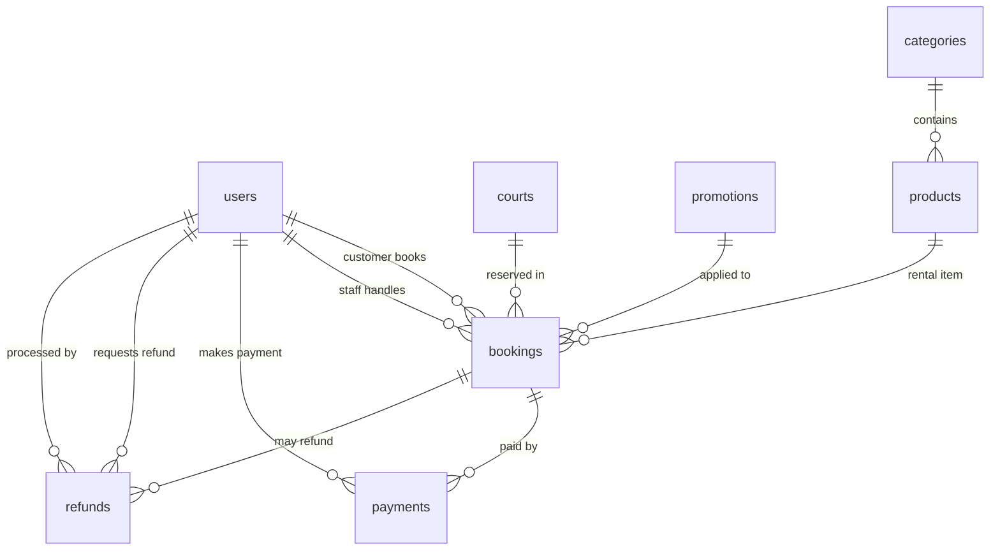
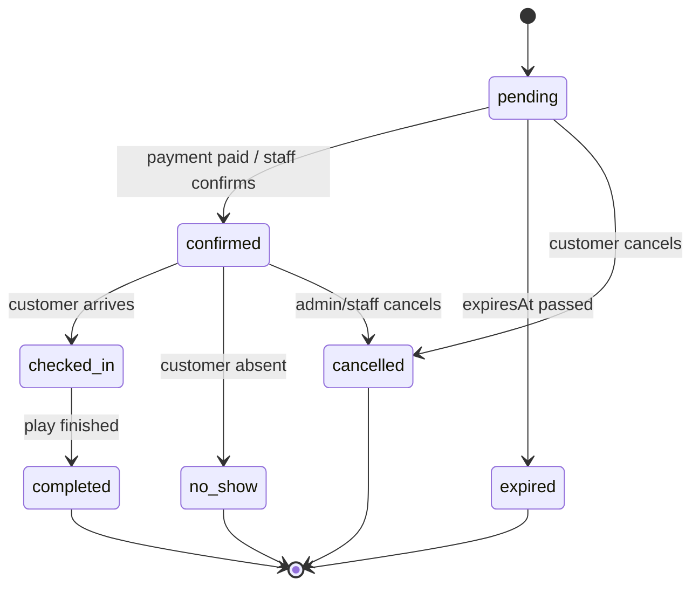

# Tài Liệu Thiết Kế Cơ Sở Dữ Liệu Pickleball Booking System (MongoDB)

Tài liệu này mô tả chi tiết thiết kế cơ sở dữ liệu cho dự án **pickleball-booking-system**. Hệ thống được xây dựng bằng **React + Node.js + MongoDB**, phù hợp cho mô hình đặt sân pickleball, quản lý sân, quản lý người dùng, đặt dịch vụ thuê kèm, thanh toán, hoàn tiền, sản phẩm và mã khuyến mãi.

Cơ sở dữ liệu sử dụng **MongoDB** với mô hình document. Ở tầng backend Node.js nên triển khai bằng **Mongoose** để định nghĩa schema, validate dữ liệu, tạo index và quản lý quan hệ bằng `ObjectId`.

---

## 1. Sơ Đồ Quan Hệ Thực Thể (ERD)



### Danh sách collection chính

| Collection | Vai trò |
|:---|:---|
| `users` | Lưu tài khoản khách hàng, nhân viên, quản trị viên |
| `courts` | Lưu thông tin sân pickleball |
| `bookings` | Lưu đơn đặt sân, khung giờ, sản phẩm thuê, tổng tiền, trạng thái |
| `payments` | Lưu giao dịch thanh toán cho booking |
| `refunds` | Lưu yêu cầu hoàn tiền và xử lý hoàn tiền |
| `products` | Lưu sản phẩm/dụng cụ cho thuê hoặc bán kèm |
| `categories` | Lưu danh mục sản phẩm |
| `promotions` | Lưu mã giảm giá, điều kiện áp dụng, giới hạn sử dụng |

---

## 2. Quy Tắc Thiết Kế Chung

1. **Khóa chính:** Mỗi document sử dụng `_id` kiểu `ObjectId` mặc định của MongoDB.
2. **Quan hệ giữa collection:** Dùng `ObjectId` để tham chiếu giữa các collection. Ví dụ `bookings.customerId` tham chiếu đến `users._id`, `bookings.courtId` tham chiếu đến `courts._id`.
3. **Tiền tệ:** Các trường tiền như `price`, `totalAmount`, `discountAmount`, `amountRequested` dùng `Number` kiểu integer, lưu theo đơn vị nhỏ nhất là **VND**. Không dùng số thập phân cho tiền VND.
4. **Thời gian:** Các trường ngày giờ dùng `Date`. Riêng giờ hiển thị trong khung đặt sân có thể lưu `startTime`, `endTime` dạng string `HH:mm` để dễ render ở frontend.
5. **Xóa mềm:** Master data như `users`, `courts`, `products`, `categories`, `promotions` không nên xóa vật lý. Nên cập nhật `status` hoặc `isActive`.
6. **Trạng thái nghiệp vụ:** Booking, payment, refund phải dùng enum rõ ràng để tránh dữ liệu tự do gây sai luồng xử lý.
7. **Chống đặt trùng sân:** Cần kiểm tra trùng `courtId + bookingDate + timeSlots.startTime/endTime` ở tầng service. MongoDB khó tạo unique index trực tiếp cho từng khoảng thời gian lồng trong array, nên logic này phải được validate trước khi tạo/cập nhật booking.
8. **Dữ liệu nhạy cảm:** `passwordHash` chỉ lưu hash, không lưu mật khẩu plain text. Nên hash bằng `bcrypt` hoặc `argon2`.
9. **Audit thời gian:** Nên bật `timestamps: true` trong Mongoose để tự sinh `createdAt` và `updatedAt`. Sơ đồ hiện có `createdAt`; tài liệu này khuyến nghị bổ sung `updatedAt` cho các collection có cập nhật thường xuyên.

---

## 3. Chi Tiết Từng Collection

### 3.1 `users` - Người dùng

Collection `users` quản lý toàn bộ tài khoản trong hệ thống, gồm khách hàng đặt sân, nhân viên xử lý booking/thanh toán và admin quản trị.

| Trường | Kiểu | Bắt buộc | Ghi chú / Ràng buộc |
|:---|:---|:---:|:---|
| `_id` | ObjectId | Có | Khóa chính |
| `fullName` | String | Có | Họ tên người dùng |
| `email` | String | Có | Unique, dùng đăng nhập |
| `phone` | String | Có | Số điện thoại liên hệ, nên unique nếu dùng OTP |
| `passwordHash` | String | Có | Mật khẩu đã hash |
| `role` | String | Có | Enum: `customer`, `staff`, `admin` |
| `status` | String | Có | Enum: `active`, `inactive`, `blocked` |
| `createdAt` | Date | Có | Thời điểm tạo tài khoản |
| `updatedAt` | Date | Khuyến nghị | Thời điểm cập nhật gần nhất |

#### Ý nghĩa nghiệp vụ

- `customer`: người dùng đặt sân, thanh toán, yêu cầu hoàn tiền.
- `staff`: nhân viên xác nhận booking, hỗ trợ check-in, xử lý thanh toán hoặc hoàn tiền.
- `admin`: quản trị toàn bộ sân, sản phẩm, khuyến mãi, người dùng.

#### Gợi ý Mongoose schema

```js
const userSchema = new Schema({
  fullName: { type: String, required: true, trim: true },
  email: { type: String, required: true, unique: true, lowercase: true, trim: true },
  phone: { type: String, required: true, trim: true },
  passwordHash: { type: String, required: true },
  role: { type: String, enum: ['customer', 'staff', 'admin'], default: 'customer' },
  status: { type: String, enum: ['active', 'inactive', 'blocked'], default: 'active' }
}, { timestamps: true });
```

---

### 3.2 `courts` - Sân pickleball

Collection `courts` lưu thông tin từng sân có thể được đặt theo giờ.

| Trường | Kiểu | Bắt buộc | Ghi chú / Ràng buộc |
|:---|:---|:---:|:---|
| `_id` | ObjectId | Có | Khóa chính |
| `name` | String | Có | Tên sân, ví dụ `Court A1`, `Court VIP 01` |
| `type` | String | Có | Enum gợi ý: `indoor`, `outdoor` |
| `surfaceType` | String | Có | Enum gợi ý: `standard`, `premium`, `synthetic`, `concrete`, `wood` |
| `basePricePerHour` | Number | Có | Giá cơ bản theo giờ, đơn vị VND |
| `facilities` | Array String | Không | Tiện ích: `lighting`, `locker`, `shower`, `parking`, `air_conditioner` |
| `status` | String | Có | Enum: `available`, `maintenance`, `inactive` |
| `createdAt` | Date | Khuyến nghị | Ngày tạo |
| `updatedAt` | Date | Khuyến nghị | Ngày cập nhật |

#### Ý nghĩa nghiệp vụ

- Chỉ sân có `status = available` mới được hiển thị cho khách đặt.
- `basePricePerHour` là giá nền. Giá thực tế từng khung giờ có thể được chốt trong `bookings.timeSlots.price`.
- `facilities` giúp frontend lọc sân theo tiện ích.

#### Gợi ý Mongoose schema

```js
const courtSchema = new Schema({
  name: { type: String, required: true, trim: true },
  type: { type: String, enum: ['indoor', 'outdoor'], required: true },
  surfaceType: { type: String, required: true, trim: true },
  basePricePerHour: { type: Number, required: true, min: 0 },
  facilities: [{ type: String, trim: true }],
  status: { type: String, enum: ['available', 'maintenance', 'inactive'], default: 'available' }
}, { timestamps: true });
```

---

### 3.3 `categories` - Danh mục sản phẩm

Collection `categories` dùng để phân loại sản phẩm thuê hoặc bán kèm.

| Trường | Kiểu | Bắt buộc | Ghi chú / Ràng buộc |
|:---|:---|:---:|:---|
| `_id` | ObjectId | Có | Khóa chính |
| `name` | String | Có | Tên danh mục, ví dụ `Vợt`, `Bóng`, `Phụ kiện`, `Nước uống` |
| `description` | String | Không | Mô tả danh mục |
| `isActive` | Boolean | Có | Mặc định `true` |
| `createdAt` | Date | Khuyến nghị | Ngày tạo |
| `updatedAt` | Date | Khuyến nghị | Ngày cập nhật |

#### Ý nghĩa nghiệp vụ

- Sản phẩm chỉ nên chọn từ danh mục đang hoạt động.
- Khi không còn dùng danh mục, cập nhật `isActive = false` thay vì xóa.

#### Gợi ý Mongoose schema

```js
const categorySchema = new Schema({
  name: { type: String, required: true, trim: true, unique: true },
  description: { type: String, trim: true },
  isActive: { type: Boolean, default: true }
}, { timestamps: true });
```

---

### 3.4 `products` - Sản phẩm / dụng cụ thuê kèm

Collection `products` lưu sản phẩm có thể được thuê hoặc bán kèm khi đặt sân, ví dụ vợt, bóng, khăn, nước uống.

| Trường | Kiểu | Bắt buộc | Ghi chú / Ràng buộc |
|:---|:---|:---:|:---|
| `_id` | ObjectId | Có | Khóa chính |
| `categoryId` | ObjectId | Có | Tham chiếu `categories._id` |
| `name` | String | Có | Tên sản phẩm |
| `price` | Number | Có | Giá thuê/bán một đơn vị, đơn vị VND |
| `stockQuantity` | Number | Có | Số lượng tồn hiện tại |
| `status` | String | Có | Enum: `active`, `inactive`, `out_of_stock` |
| `createdAt` | Date | Khuyến nghị | Ngày tạo |
| `updatedAt` | Date | Khuyến nghị | Ngày cập nhật |

#### Ý nghĩa nghiệp vụ

- `stockQuantity` phải lớn hơn hoặc bằng 0.
- Nếu `stockQuantity = 0`, hệ thống có thể tự chuyển `status = out_of_stock`.
- Khi booking có `rentalItems`, hệ thống cần kiểm tra số lượng tồn trước khi xác nhận booking.

#### Gợi ý Mongoose schema

```js
const productSchema = new Schema({
  categoryId: { type: Schema.Types.ObjectId, ref: 'Category', required: true, index: true },
  name: { type: String, required: true, trim: true },
  price: { type: Number, required: true, min: 0 },
  stockQuantity: { type: Number, required: true, min: 0, default: 0 },
  status: { type: String, enum: ['active', 'inactive', 'out_of_stock'], default: 'active' }
}, { timestamps: true });
```

---

### 3.5 `promotions` - Khuyến mãi

Collection `promotions` quản lý mã giảm giá áp dụng cho booking.

| Trường | Kiểu | Bắt buộc | Ghi chú / Ràng buộc |
|:---|:---|:---:|:---|
| `_id` | ObjectId | Có | Khóa chính |
| `code` | String | Có | Unique, mã giảm giá nhập ở frontend |
| `description` | String | Không | Mô tả chương trình |
| `discountType` | String | Có | Enum: `percentage`, `fixed_amount` |
| `discountValue` | Number | Có | Nếu percentage: phần trăm; nếu fixed_amount: số tiền VND |
| `maxDiscountAmount` | Number | Không | Mức giảm tối đa, dùng cho percentage |
| `startDate` | Date | Có | Ngày bắt đầu hiệu lực |
| `endDate` | Date | Có | Ngày kết thúc hiệu lực |
| `usageLimit` | Number | Không | Tổng lượt được dùng |
| `usedCount` | Number | Có | Số lượt đã dùng, mặc định 0 |
| `isActive` | Boolean | Có | Mặc định `true` |
| `createdAt` | Date | Khuyến nghị | Ngày tạo |
| `updatedAt` | Date | Khuyến nghị | Ngày cập nhật |

#### Ý nghĩa nghiệp vụ

- Mã chỉ hợp lệ khi `isActive = true`, ngày hiện tại nằm trong `startDate` - `endDate`, và `usedCount < usageLimit` nếu có giới hạn.
- Với `discountType = percentage`, `discountValue` nên nằm trong khoảng 1 - 100.
- Với `discountType = fixed_amount`, `discountValue` là số tiền giảm trực tiếp.

#### Gợi ý Mongoose schema

```js
const promotionSchema = new Schema({
  code: { type: String, required: true, unique: true, uppercase: true, trim: true },
  description: { type: String, trim: true },
  discountType: { type: String, enum: ['percentage', 'fixed_amount'], required: true },
  discountValue: { type: Number, required: true, min: 0 },
  maxDiscountAmount: { type: Number, min: 0 },
  startDate: { type: Date, required: true },
  endDate: { type: Date, required: true },
  usageLimit: { type: Number, min: 0 },
  usedCount: { type: Number, min: 0, default: 0 },
  isActive: { type: Boolean, default: true }
}, { timestamps: true });
```

---

### 3.6 `bookings` - Đơn đặt sân

Collection `bookings` là trung tâm của hệ thống. Mỗi document thể hiện một lần đặt sân của khách hàng, gồm sân, ngày đặt, các khung giờ, sản phẩm thuê kèm, mã khuyến mãi, tổng tiền và trạng thái thanh toán.

| Trường | Kiểu | Bắt buộc | Ghi chú / Ràng buộc |
|:---|:---|:---:|:---|
| `_id` | ObjectId | Có | Khóa chính |
| `bookingCode` | String | Có | Unique, mã booking hiển thị cho khách, ví dụ `BK-20260530-0001` |
| `customerId` | ObjectId | Có | Tham chiếu `users._id`, người đặt sân |
| `staffId` | ObjectId hoặc null | Không | Tham chiếu `users._id`, nhân viên xử lý/check-in |
| `courtId` | ObjectId | Có | Tham chiếu `courts._id` |
| `bookingDate` | Date | Có | Ngày chơi |
| `timeSlots` | Array Object | Có | Danh sách khung giờ đặt |
| `timeSlots.startTime` | String | Có | Giờ bắt đầu, format `HH:mm` |
| `timeSlots.endTime` | String | Có | Giờ kết thúc, format `HH:mm` |
| `timeSlots.price` | Number | Có | Giá chốt cho khung giờ |
| `rentalItems` | Array Object | Không | Danh sách sản phẩm/dụng cụ thuê kèm |
| `rentalItems.productId` | ObjectId | Có nếu có item | Tham chiếu `products._id` |
| `rentalItems.quantity` | Number | Có nếu có item | Số lượng thuê/mua |
| `rentalItems.price` | Number | Có nếu có item | Đơn giá tại thời điểm booking |
| `promotionId` | ObjectId hoặc null | Không | Tham chiếu `promotions._id` |
| `subTotal` | Number | Có | Tổng tiền trước giảm giá |
| `discountAmount` | Number | Có | Số tiền giảm |
| `totalAmount` | Number | Có | Tổng tiền cuối cùng |
| `paymentStatus` | String | Có | Enum: `unpaid`, `pending`, `paid`, `partially_refunded`, `refunded`, `failed` |
| `status` | String | Có | Enum: `pending`, `confirmed`, `checked_in`, `completed`, `cancelled`, `expired`, `no_show` |
| `expiresAt` | Date | Không | Thời điểm hết hạn giữ chỗ nếu chưa thanh toán |
| `createdAt` | Date | Có | Ngày tạo booking |
| `updatedAt` | Date | Khuyến nghị | Ngày cập nhật |

#### Ý nghĩa nghiệp vụ

- `bookingCode` dùng cho khách tra cứu và cho nhân viên check-in.
- `timeSlots` cho phép một booking đặt nhiều khung giờ liên tiếp hoặc rời nhau trong cùng ngày.
- `rentalItems.price` nên lưu giá tại thời điểm đặt, không phụ thuộc giá hiện tại trong `products`.
- `subTotal = tổng tiền sân + tổng tiền rentalItems`.
- `totalAmount = subTotal - discountAmount`.
- `expiresAt` dùng để tự động hủy booking giữ chỗ nếu khách không thanh toán đúng hạn.

#### Luồng trạng thái booking



#### Gợi ý Mongoose schema

```js
const timeSlotSchema = new Schema({
  startTime: { type: String, required: true },
  endTime: { type: String, required: true },
  price: { type: Number, required: true, min: 0 }
}, { _id: false });

const rentalItemSchema = new Schema({
  productId: { type: Schema.Types.ObjectId, ref: 'Product', required: true },
  quantity: { type: Number, required: true, min: 1 },
  price: { type: Number, required: true, min: 0 }
}, { _id: false });

const bookingSchema = new Schema({
  bookingCode: { type: String, required: true, unique: true, trim: true },
  customerId: { type: Schema.Types.ObjectId, ref: 'User', required: true, index: true },
  staffId: { type: Schema.Types.ObjectId, ref: 'User' },
  courtId: { type: Schema.Types.ObjectId, ref: 'Court', required: true, index: true },
  bookingDate: { type: Date, required: true, index: true },
  timeSlots: { type: [timeSlotSchema], required: true, validate: v => v.length > 0 },
  rentalItems: { type: [rentalItemSchema], default: [] },
  promotionId: { type: Schema.Types.ObjectId, ref: 'Promotion' },
  subTotal: { type: Number, required: true, min: 0 },
  discountAmount: { type: Number, default: 0, min: 0 },
  totalAmount: { type: Number, required: true, min: 0 },
  paymentStatus: {
    type: String,
    enum: ['unpaid', 'pending', 'paid', 'partially_refunded', 'refunded', 'failed'],
    default: 'unpaid'
  },
  status: {
    type: String,
    enum: ['pending', 'confirmed', 'checked_in', 'completed', 'cancelled', 'expired', 'no_show'],
    default: 'pending'
  },
  expiresAt: { type: Date }
}, { timestamps: true });
```

---

### 3.7 `payments` - Thanh toán

Collection `payments` lưu từng giao dịch thanh toán phát sinh cho booking.

| Trường | Kiểu | Bắt buộc | Ghi chú / Ràng buộc |
|:---|:---|:---:|:---|
| `_id` | ObjectId | Có | Khóa chính |
| `bookingId` | ObjectId | Có | Tham chiếu `bookings._id` |
| `customerId` | ObjectId | Có | Tham chiếu `users._id` |
| `amount` | Number | Có | Số tiền thanh toán, đơn vị VND |
| `paymentMethod` | String | Có | Enum: `cash`, `bank_transfer`, `momo`, `vnpay`, `zalopay`, `card` |
| `transactionId` | String | Không | Mã giao dịch từ cổng thanh toán |
| `paymentDate` | Date | Có | Thời điểm thanh toán |
| `status` | String | Có | Enum: `pending`, `success`, `failed`, `cancelled`, `refunded` |
| `note` | String | Không | Ghi chú giao dịch |
| `createdAt` | Date | Khuyến nghị | Ngày tạo |
| `updatedAt` | Date | Khuyến nghị | Ngày cập nhật |

#### Ý nghĩa nghiệp vụ

- Một booking có thể có nhiều payment nếu hỗ trợ thanh toán lại sau thất bại hoặc đặt cọc/thanh toán phần còn lại.
- Khi payment thành công, cập nhật `bookings.paymentStatus = paid` và thường chuyển `bookings.status = confirmed`.
- `transactionId` nên unique nếu đến từ cổng thanh toán để tránh ghi nhận trùng giao dịch.

#### Gợi ý Mongoose schema

```js
const paymentSchema = new Schema({
  bookingId: { type: Schema.Types.ObjectId, ref: 'Booking', required: true, index: true },
  customerId: { type: Schema.Types.ObjectId, ref: 'User', required: true, index: true },
  amount: { type: Number, required: true, min: 0 },
  paymentMethod: {
    type: String,
    enum: ['cash', 'bank_transfer', 'momo', 'vnpay', 'zalopay', 'card'],
    required: true
  },
  transactionId: { type: String, trim: true },
  paymentDate: { type: Date, default: Date.now },
  status: { type: String, enum: ['pending', 'success', 'failed', 'cancelled', 'refunded'], default: 'pending' },
  note: { type: String, trim: true }
}, { timestamps: true });
```

---

### 3.8 `refunds` - Hoàn tiền

Collection `refunds` quản lý yêu cầu hoàn tiền của khách hàng và trạng thái xử lý từ nhân viên/admin.

| Trường | Kiểu | Bắt buộc | Ghi chú / Ràng buộc |
|:---|:---|:---:|:---|
| `_id` | ObjectId | Có | Khóa chính |
| `bookingId` | ObjectId | Có | Tham chiếu `bookings._id` |
| `customerId` | ObjectId | Có | Tham chiếu `users._id`, người yêu cầu hoàn tiền |
| `processedBy` | ObjectId hoặc null | Không | Tham chiếu `users._id`, nhân viên/admin xử lý |
| `amountRequested` | Number | Có | Số tiền yêu cầu hoàn |
| `reason` | String | Có | Lý do yêu cầu hoàn tiền |
| `status` | String | Có | Enum: `requested`, `approved`, `rejected`, `processing`, `completed`, `failed` |
| `refundTransactionId` | String | Không | Mã giao dịch hoàn tiền |
| `rejectionReason` | String | Không | Bắt buộc nếu `status = rejected` |
| `createdAt` | Date | Có | Ngày tạo yêu cầu |
| `updatedAt` | Date | Khuyến nghị | Ngày cập nhật |

#### Ý nghĩa nghiệp vụ

- Hoàn tiền chỉ nên áp dụng cho booking đã thanh toán.
- `amountRequested` không được lớn hơn số tiền đã thanh toán thực tế.
- Khi hoàn tiền hoàn tất toàn bộ, cập nhật `bookings.paymentStatus = refunded`.
- Khi chỉ hoàn một phần, cập nhật `bookings.paymentStatus = partially_refunded`.
- Nếu từ chối hoàn tiền, bắt buộc nhập `rejectionReason`.

#### Gợi ý Mongoose schema

```js
const refundSchema = new Schema({
  bookingId: { type: Schema.Types.ObjectId, ref: 'Booking', required: true, index: true },
  customerId: { type: Schema.Types.ObjectId, ref: 'User', required: true, index: true },
  processedBy: { type: Schema.Types.ObjectId, ref: 'User' },
  amountRequested: { type: Number, required: true, min: 0 },
  reason: { type: String, required: true, trim: true },
  status: {
    type: String,
    enum: ['requested', 'approved', 'rejected', 'processing', 'completed', 'failed'],
    default: 'requested'
  },
  refundTransactionId: { type: String, trim: true },
  rejectionReason: { type: String, trim: true }
}, { timestamps: true });
```

---

## 4. Quan Hệ Dữ Liệu Và Cardinality

| Quan hệ | Kiểu | Mô tả |
|:---|:---|:---|
| `users` -> `bookings` | 1 - N | Một khách hàng có thể tạo nhiều booking |
| `users` -> `bookings.staffId` | 1 - N | Một nhân viên có thể xử lý nhiều booking |
| `courts` -> `bookings` | 1 - N | Một sân có nhiều booking theo ngày/giờ khác nhau |
| `bookings` -> `payments` | 1 - N | Một booking có thể có nhiều giao dịch thanh toán |
| `bookings` -> `refunds` | 1 - N | Một booking có thể có nhiều yêu cầu hoàn tiền |
| `users` -> `payments` | 1 - N | Một khách hàng có nhiều payment |
| `users` -> `refunds` | 1 - N | Một khách hàng có nhiều yêu cầu refund |
| `categories` -> `products` | 1 - N | Một danh mục chứa nhiều sản phẩm |
| `products` -> `bookings.rentalItems` | 1 - N | Một sản phẩm có thể xuất hiện trong nhiều booking |
| `promotions` -> `bookings` | 1 - N | Một mã giảm giá có thể được dùng cho nhiều booking |

---

## 5. Quy Tắc Nghiệp Vụ Cần Enforcement

### 5.1 Quy tắc đặt sân

1. Không cho phép tạo booking nếu `court.status != available`.
2. Không cho phép booking ở ngày trong quá khứ.
3. Không cho phép `timeSlots` rỗng.
4. Mỗi `timeSlot.startTime` phải nhỏ hơn `timeSlot.endTime`.
5. Không cho phép hai booking active trùng cùng sân, cùng ngày, cùng khoảng giờ.
6. Các trạng thái được xem là đang chiếm sân: `pending`, `confirmed`, `checked_in`.
7. Các trạng thái không còn chiếm sân: `cancelled`, `expired`, `completed`, `no_show`.

### 5.2 Quy tắc tính tiền

1. `subTotal = sum(timeSlots.price) + sum(rentalItems.quantity * rentalItems.price)`.
2. `discountAmount` không được lớn hơn `subTotal`.
3. `totalAmount = subTotal - discountAmount`.
4. `totalAmount` không được nhỏ hơn 0.
5. Giá trong booking phải là giá chốt tại thời điểm đặt, không tự thay đổi khi `courts` hoặc `products` đổi giá.

### 5.3 Quy tắc sản phẩm thuê kèm

1. Chỉ cho phép thêm sản phẩm có `status = active`.
2. `quantity` phải lớn hơn 0.
3. `stockQuantity` phải đủ trước khi xác nhận booking.
4. Khi booking được xác nhận, có thể trừ tồn hoặc giữ tồn tùy thiết kế nghiệp vụ.
5. Khi booking bị hủy trước khi sử dụng, cần hoàn lại tồn đã giữ/trừ.

### 5.4 Quy tắc khuyến mãi

1. Mã khuyến mãi phải tồn tại và `isActive = true`.
2. Ngày booking hoặc ngày hiện tại phải nằm trong `startDate` và `endDate`.
3. Nếu có `usageLimit`, chỉ cho áp dụng khi `usedCount < usageLimit`.
4. Với mã phần trăm, áp dụng `maxDiscountAmount` nếu có.
5. Sau khi booking thanh toán thành công, tăng `usedCount` để tránh mã bị tính lượt dùng khi khách chưa thanh toán.

### 5.5 Quy tắc thanh toán

1. Chỉ tạo payment cho booking chưa được thanh toán đủ.
2. Payment thành công phải có `amount > 0`.
3. Nếu dùng cổng thanh toán, `transactionId` phải không trùng.
4. Khi payment `success`, cập nhật booking tương ứng trong cùng transaction/session nếu dùng MongoDB replica set.
5. Nếu payment thất bại, không được chuyển booking sang `confirmed`.

### 5.6 Quy tắc hoàn tiền

1. Chỉ cho refund với booking có `paymentStatus` là `paid` hoặc `partially_refunded`.
2. Tổng tiền refund hoàn tất không được vượt quá tổng tiền đã thanh toán.
3. Nếu `status = rejected`, phải có `rejectionReason`.
4. Nếu `status = completed`, nên có `refundTransactionId`.
5. Sau refund, cập nhật lại `bookings.paymentStatus`.

---

## 6. Indexes Khuyến Nghị

Các index dưới đây giúp tối ưu truy vấn thường dùng trong hệ thống đặt sân.

### 6.1 `users`

```js
db.users.createIndex({ email: 1 }, { unique: true });
db.users.createIndex({ phone: 1 });
db.users.createIndex({ role: 1, status: 1 });
```

### 6.2 `courts`

```js
db.courts.createIndex({ status: 1 });
db.courts.createIndex({ type: 1, surfaceType: 1 });
db.courts.createIndex({ name: 1 }, { unique: true });
```

### 6.3 `bookings`

```js
db.bookings.createIndex({ bookingCode: 1 }, { unique: true });
db.bookings.createIndex({ customerId: 1, createdAt: -1 });
db.bookings.createIndex({ staffId: 1, bookingDate: 1 });
db.bookings.createIndex({ courtId: 1, bookingDate: 1, status: 1 });
db.bookings.createIndex({ paymentStatus: 1, status: 1 });
db.bookings.createIndex({ expiresAt: 1 }, { expireAfterSeconds: 0 });
```

Lưu ý với TTL index `expiresAt`: nếu dùng TTL để tự xóa document thì không phù hợp với yêu cầu giữ lịch sử. Với hệ thống booking nên dùng job nền để cập nhật `status = expired` thay vì để MongoDB xóa document. Chỉ dùng TTL nếu collection riêng dùng cho giữ chỗ tạm.

### 6.4 `payments`

```js
db.payments.createIndex({ bookingId: 1, status: 1 });
db.payments.createIndex({ customerId: 1, paymentDate: -1 });
db.payments.createIndex({ transactionId: 1 }, { unique: true, sparse: true });
```

### 6.5 `refunds`

```js
db.refunds.createIndex({ bookingId: 1, status: 1 });
db.refunds.createIndex({ customerId: 1, createdAt: -1 });
db.refunds.createIndex({ processedBy: 1, status: 1 });
db.refunds.createIndex({ refundTransactionId: 1 }, { unique: true, sparse: true });
```

### 6.6 `products`

```js
db.products.createIndex({ categoryId: 1, status: 1 });
db.products.createIndex({ name: 'text' });
db.products.createIndex({ stockQuantity: 1 });
```

### 6.7 `categories`

```js
db.categories.createIndex({ name: 1 }, { unique: true });
db.categories.createIndex({ isActive: 1 });
```

### 6.8 `promotions`

```js
db.promotions.createIndex({ code: 1 }, { unique: true });
db.promotions.createIndex({ isActive: 1, startDate: 1, endDate: 1 });
```

---

## 7. Gợi Ý Cấu Trúc Thư Mục Backend Node.js

```txt
server/
  src/
    config/
      database.js
    models/
      User.js
      Court.js
      Category.js
      Product.js
      Promotion.js
      Booking.js
      Payment.js
      Refund.js
    controllers/
      booking.controller.js
      payment.controller.js
      refund.controller.js
    services/
      booking.service.js
      payment.service.js
      promotion.service.js
      product.service.js
    routes/
      booking.routes.js
      payment.routes.js
      refund.routes.js
    validators/
      booking.validator.js
      payment.validator.js
```

---

## 8. Luồng Dữ Liệu Chính

### 8.1 Luồng đặt sân

1. Khách hàng chọn ngày, sân và khung giờ ở React.
2. Frontend gọi API kiểm tra sân trống.
3. Backend kiểm tra `courtId`, `bookingDate`, `timeSlots` với các booking active.
4. Backend tính `subTotal`, áp dụng promotion nếu có.
5. Backend tạo booking với `status = pending`, `paymentStatus = unpaid`.
6. Nếu cần giữ chỗ có thời hạn, set `expiresAt`.
7. Khách thanh toán.
8. Payment thành công thì booking chuyển `status = confirmed`, `paymentStatus = paid`.

### 8.2 Luồng thanh toán

1. Frontend gửi yêu cầu tạo payment cho booking.
2. Backend kiểm tra booking còn hợp lệ và chưa thanh toán đủ.
3. Backend tạo payment `pending`.
4. Sau callback từ cổng thanh toán, cập nhật payment `success` hoặc `failed`.
5. Nếu `success`, cập nhật booking sang `confirmed`.

### 8.3 Luồng hủy và hoàn tiền

1. Khách hàng hoặc nhân viên yêu cầu hủy booking.
2. Backend kiểm tra chính sách hủy theo thời gian trước giờ chơi.
3. Nếu booking đã thanh toán, tạo refund `requested`.
4. Staff/admin duyệt refund.
5. Sau khi hoàn tiền thành công, cập nhật refund `completed` và booking `paymentStatus`.

---

## 9. Ví Dụ Document

### 9.1 Ví dụ `bookings`

```json
{
  "_id": "6659f1d9d8b5f1b1a8f00001",
  "bookingCode": "BK-20260530-0001",
  "customerId": "6659ef2dd8b5f1b1a8f00010",
  "staffId": null,
  "courtId": "6659ee9bd8b5f1b1a8f00020",
  "bookingDate": "2026-05-30T00:00:00.000Z",
  "timeSlots": [
    {
      "startTime": "18:00",
      "endTime": "19:00",
      "price": 180000
    },
    {
      "startTime": "19:00",
      "endTime": "20:00",
      "price": 200000
    }
  ],
  "rentalItems": [
    {
      "productId": "6659f08fd8b5f1b1a8f00030",
      "quantity": 2,
      "price": 50000
    }
  ],
  "promotionId": "6659f0eed8b5f1b1a8f00040",
  "subTotal": 480000,
  "discountAmount": 50000,
  "totalAmount": 430000,
  "paymentStatus": "paid",
  "status": "confirmed",
  "expiresAt": null,
  "createdAt": "2026-05-30T10:00:00.000Z",
  "updatedAt": "2026-05-30T10:03:00.000Z"
}
```

### 9.2 Ví dụ `payments`

```json
{
  "_id": "6659f35dd8b5f1b1a8f00050",
  "bookingId": "6659f1d9d8b5f1b1a8f00001",
  "customerId": "6659ef2dd8b5f1b1a8f00010",
  "amount": 430000,
  "paymentMethod": "vnpay",
  "transactionId": "VNPAY-20260530-ABC123",
  "paymentDate": "2026-05-30T10:03:00.000Z",
  "status": "success",
  "note": "Thanh toán qua VNPay",
  "createdAt": "2026-05-30T10:02:00.000Z",
  "updatedAt": "2026-05-30T10:03:00.000Z"
}
```

---

## 10. Checklist Triển Khai

| Hạng mục | Trạng thái khuyến nghị |
|:---|:---|
| Tạo Mongoose schema cho 8 collection | Bắt buộc |
| Tạo enum rõ ràng cho role/status/paymentStatus | Bắt buộc |
| Tạo index cho email, bookingCode, courtId + bookingDate | Bắt buộc |
| Validate trùng lịch đặt sân ở service | Bắt buộc |
| Hash password bằng bcrypt/argon2 | Bắt buộc |
| Tính tiền ở backend, không tin giá từ frontend | Bắt buộc |
| Lưu giá chốt trong booking timeSlots/rentalItems | Bắt buộc |
| Dùng transaction cho payment/refund nếu có replica set | Khuyến nghị |
| Job tự chuyển booking quá hạn sang expired | Khuyến nghị |
| Audit log cho admin action | Có thể bổ sung |

---

## 11. Kết Luận

Thiết kế database này tập trung vào nghiệp vụ cốt lõi của **pickleball-booking-system**:

- Quản lý người dùng theo vai trò.
- Quản lý sân và trạng thái sân.
- Đặt sân theo ngày và nhiều khung giờ.
- Thuê hoặc mua sản phẩm kèm booking.
- Áp dụng mã khuyến mãi.
- Thanh toán và hoàn tiền.
- Tối ưu truy vấn lịch sân, lịch sử booking, payment và refund.

Với React + Node.js + MongoDB, thiết kế này phù hợp để triển khai bằng Mongoose, dễ mở rộng thêm các module như đánh giá sân, gói thành viên, đặt lịch huấn luyện viên, thông báo realtime và báo cáo doanh thu.
