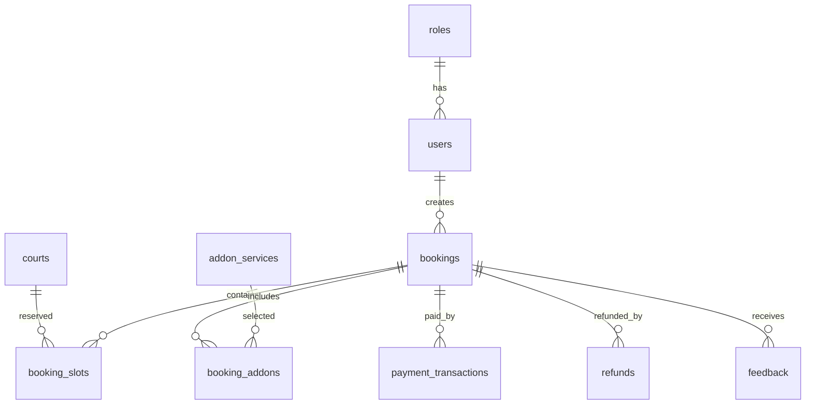

# Pickleball Booking System - MySQL Database Design

Database dung cho he thong dat san pickleball truc tuyen tai **mot co so o Ha Noi**.

## Scope

- Khong quan ly nhieu khu vuc.
- Khong quan ly nhieu chi nhanh.
- Khong co `branches`, `regions`, `clubs`.
- Mot co so co nhieu san con.
- User co role Admin, Owner, Staff, Customer.

## Script

- File: `mysql-workbench-schema.sql`
- Database: `pickleball_booking_system`
- MySQL: 8.0+

## Bang Chinh

| Nhom | Bang |
| --- | --- |
| Cau hinh co so | `settings` |
| Tai khoan | `roles`, `users` |
| San va gia | `courts`, `price_rules` |
| Dat san | `slot_holds`, `bookings`, `booking_slots` |
| Dich vu kem | `categories`, `addon_services`, `booking_addons` |
| Thanh toan | `payment_transactions`, `refunds` |
| Van hanh | `feedback`, `email_logs`, `audit_logs` |

## Quan He



## Quy Tac Du Lieu

- `users.email` bat buoc co duoi `@gmail.com`.
- `users.password` luu plain text theo yeu cau hien tai.
- `users.avatar_url` luu URL avatar hoac data URL anh upload tu frontend.
- `courts.address` luu dia chi rieng cho tung san.
- API khong duoc tra ve `password`.
- Tien VND luu bang integer.
- `booking_slots` tach rieng de chong trung lich theo tung khoang gio.
- `slot_holds` giu slot tam thoi trong 10 phut.
- Booking active: `pending`, `confirmed`, `checked_in`.
- Booking khong chiem san: `cancelled`, `expired`, `completed`, `no_show`.
- Transaction data khong xoa vat ly.

## Import MySQL Workbench

1. Mo MySQL Workbench.
2. `File > Open SQL Script`.
3. Chon `mysql-workbench-schema.sql`.
4. Run script.
5. Refresh schema `pickleball_booking_system`.

## User Demo

Tat ca user demo co mat khau:

```text
123456
```

| Role | Email |
| --- | --- |
| Admin | `pickleball.admin@gmail.com` |
| Owner | `pickleball.owner@gmail.com` |
| Staff | `pickleball.staff@gmail.com` |
| Customer | `pickleball.customer@gmail.com` |

Seed co them 10 tai khoan Staff (`pickleball.staff01@gmail.com` den `pickleball.staff10@gmail.com`) va 10 tai khoan Customer (`pickleball.customer01@gmail.com` den `pickleball.customer10@gmail.com`).

## Backend Env

```env
DB_HOST=127.0.0.1
DB_PORT=3306
DB_USER=root
DB_PASSWORD=your_password
DB_NAME=pickleball_booking_system
DB_CONNECTION_LIMIT=10
AUTH_TOKEN_SECRET=replace_this_secret
```
